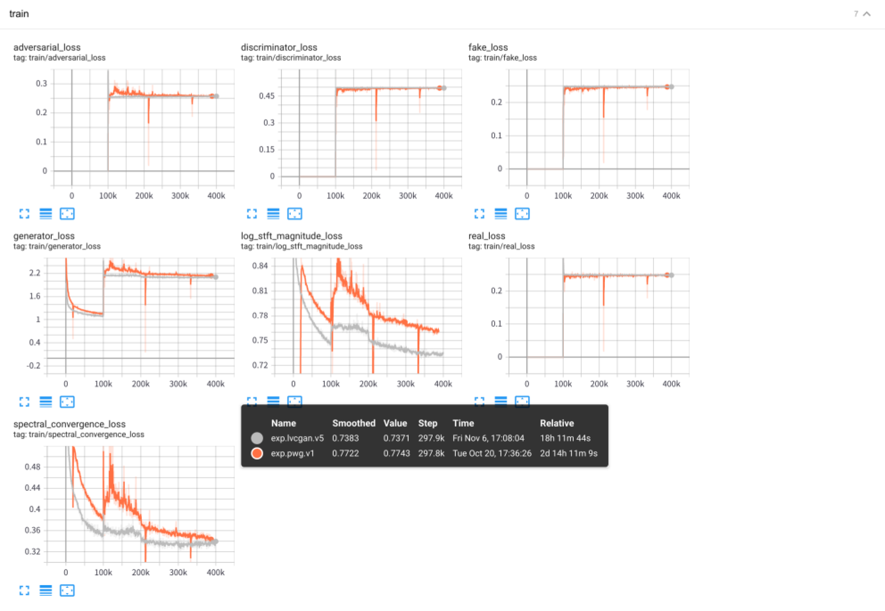
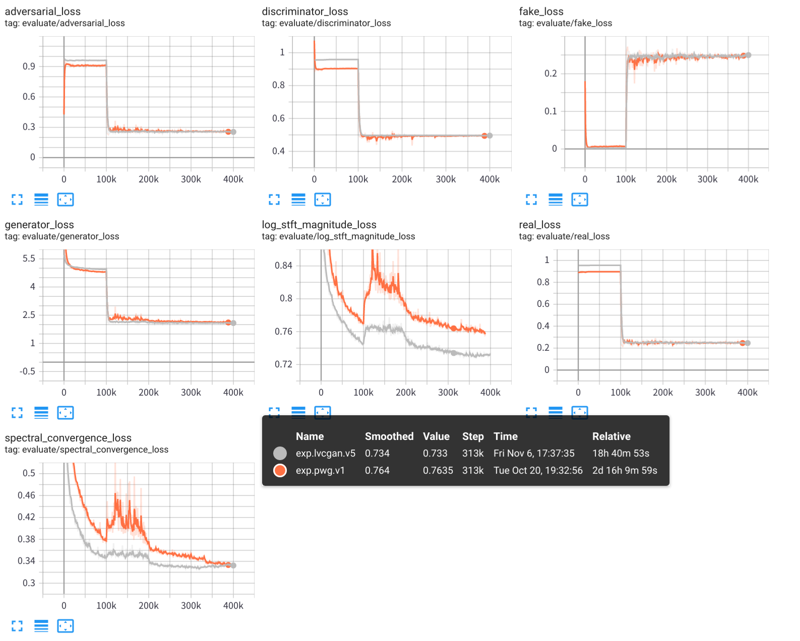

# LVCNet: Efficient Condition-Dependent Modeling Network for Waveform Generation

Using LVCNet to design the generator of Parallel WaveGAN and the *same strategy* to train it, 
the inference speed of the new vocoder is **more than 5x faster** than the original vocoder *without any degration in audio quality*.  


## Training and Test 

1. prepare the data, download `LJSpeech` dataset from https://keithito.com/LJ-Speech-Dataset/,
and save it in `data/LJSpeech-1.1`. Then run 
    ```python
    python -m vocoder.preprocess --data-dir ./data/LJSpeech-1.1 --config configs/lvcgan.v1.yaml
    ```
    The mel-sepctrums are calculated and saved in the folder `temp/`. 

2. Training LVCNet
    ```python
    python -m vocoder.train --config configs/lvcgan.v1.yaml --exp-dir exps/exp.lvcgan.v1
    ```

3. Test LVCNet 
    ```python 
    python -m vocoder.test --config configs/lvcgan.v1.yaml --exp-dir exps/exp.lvcgan.v1
    ```

4. The experimental results, including training logs, model checkpoints and synthesized audios, are stored in the folder `exps/exp.lvcgan.v1/`.  
    Similarity, you can also use the config file `configs/pwg.v1.yaml` to train a Parallel WaveGAN model. 
    ```Python
    # training
    python -m vocoder.train --config configs/pwg.v1.yaml --exp-dir exps/exp.pwg.v1
    # test
    python -m vocoder.test --config configs/pwg.v1.yaml --exp-dir exps/exp.pwg.v1
    ```

## Results 

### Tensorboard 

Use the tensorboard to view the experimental training process:

```
tensorboard --logdir exps
```

### Traning Loss


### Evaluate Loss



### Aduio Sample 

Audio Samples are saved in `samples/`, where  
 - `samples/*_lvc.wav` are generated by LVCNet, 
 - `samples/*_pwg.wav` are generated by Parallel WaveGAN, 
 - `samples/*_real.wav` are the real audio. 


## Reference 
> https://github.com/kan-bayashi/ParallelWaveGAN  
> https://github.com/lmnt-com/diffwave  
